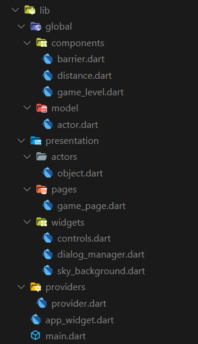

# Bounce Flutter

Bounce game built in flutter

## Summary
Flutter is pretty cool. This is just a small project I did to
test it out. There are no tests and the code quality is what you'd expect
from a weekend hack.

## How To Use

To clone and run this application, you'll need [Git](https://git-scm.com) and [Flutter](https://flutter.dev/docs/get-started/install) installed on your computer. From your command line:

```bash
# Clone this repository
$ git clone https://github.com/Harraby/Mobile_Apps.git

# Go into the repository
$ cd Mobile_Apps.git

# Install dependencies
$ flutter packages get

# Run the app
$ flutter run
```

### Directory Structure

The project directory structure is as follows:

```
├── android
├── asset
├── build
├── images
├── ios
├── lib
├── pubspec.lock
├── pubspec.yaml

```

Other directories besides **lib**:

directory | explain
---|---
images | readme images files
asset | images 

Then the lib directory





````C:\Users\Harraby\Desktop\Old_Code\Flutter\bounce_game-master